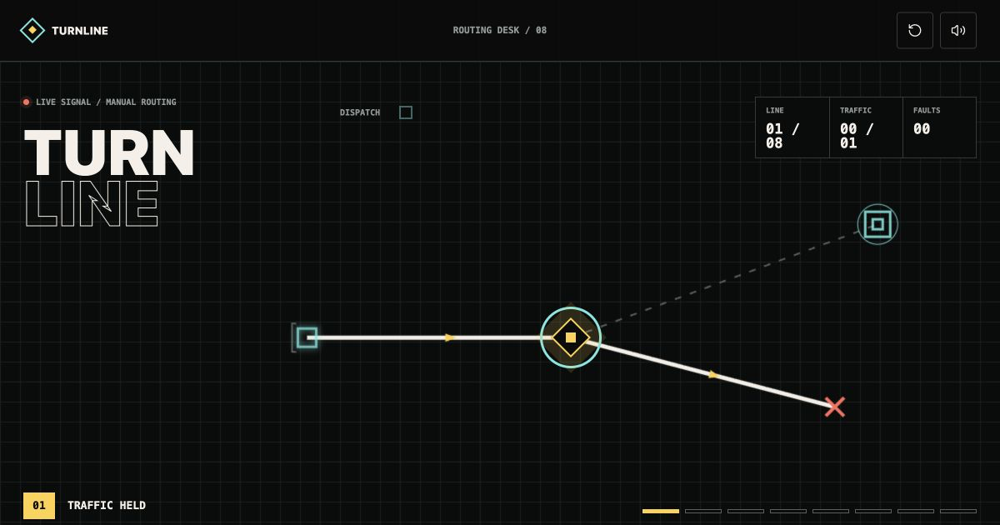

# Process overview

## What I built

TURNLINE is an eight-line live sorting game. The player changes junctions while three signal shapes move toward matching terminals. A pulsing first switch and broken default route expose the only verb without a tutorial.

## The moments that mattered

1. **I made restraint enforceable before designing.** The harness limits the game to junction switching, bans tutorial language and second mechanics, and requires terminal states and both marking viewports. One deliberately red contract commit had to be followed immediately by green ([`03c1a08`](https://github.com/comp4020-agentic-coding-studio/comp4020-crit5-xty116/commit/03c1a08)).

2. **I separated rules from presentation.** Focused tests described wrong routes, live switching, and immutable endings before Canvas or audio existed. The pure graph model made those contracts pass before visual work began ([`03c1a08...fe5d9f7`](https://github.com/comp4020-agentic-coding-studio/comp4020-crit5-xty116/compare/03c1a08...fe5d9f7)).

3. **Feedback exposed shallow complexity.** The first version carried one signal per line, so switches could be configured before motion. I kept one button but introduced delayed geometric traffic ([`36e7788`](https://github.com/comp4020-agentic-coding-studio/comp4020-crit5-xty116/commit/36e7788)). A second difficulty pass extended the campaign to eight lines: the last three carry four, five, and six signals with tested schedules, ending on three coordinated junctions ([`8bbc20d`](https://github.com/comp4020-agentic-coding-studio/comp4020-crit5-xty116/commit/8bbc20d)).

4. **Playing changed the interface.** I completed all eight lines at 1920x1080 with zero faults, then checked the six-signal final state at 390x844. There was no overflow, the queue used 303px, and switches remained 54px. Earlier, an upcoming signal looked like stray decoration, so I grouped the tokens under a visible `DISPATCH` label. The suite now has 32 tests.

5. **Performance evidence changed the implementation.** CI caught idle rendering at 0.86 performance and 544ms TBT. Canvas now draws on-demand, batches the grid, and uses a three-run CI median. The last public run scored performance 100, accessibility 100, and best practices 96 ([`ce4207e...6a23fbe`](https://github.com/comp4020-agentic-coding-studio/comp4020-crit5-xty116/compare/ce4207e...6a23fbe)).
